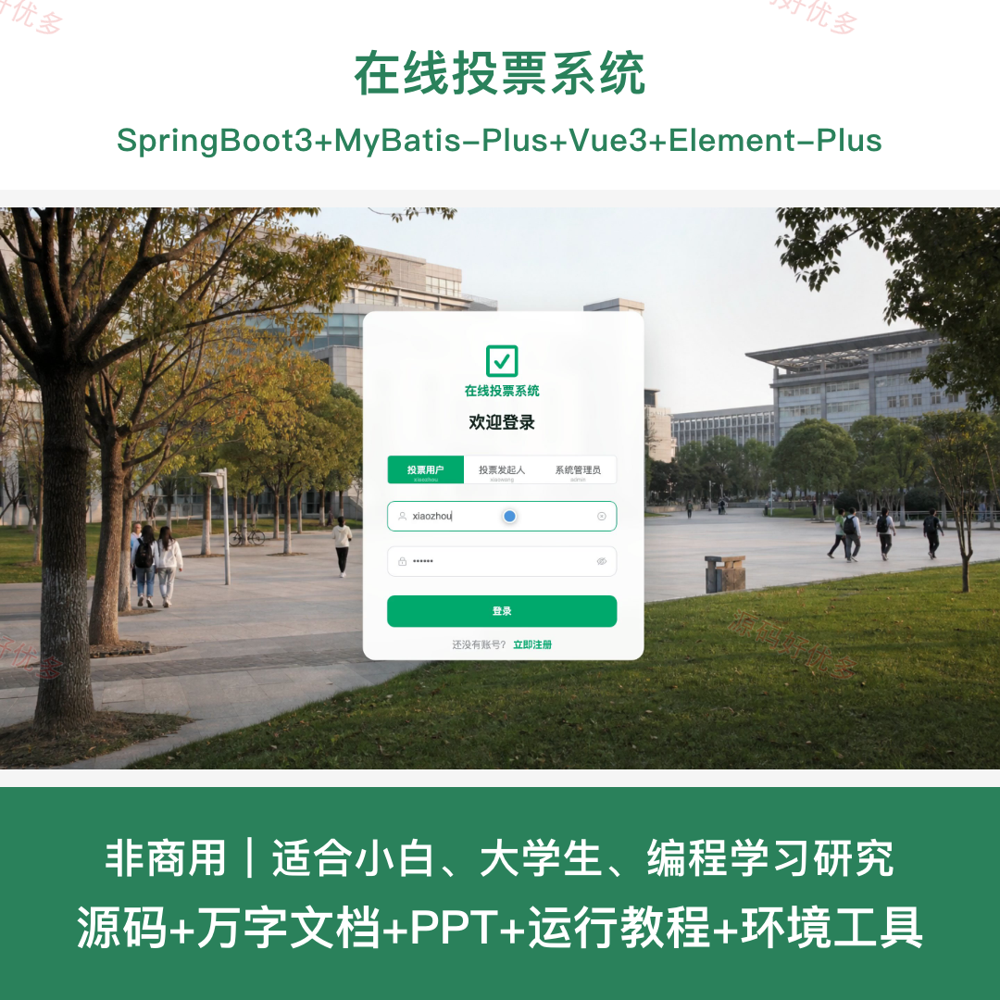
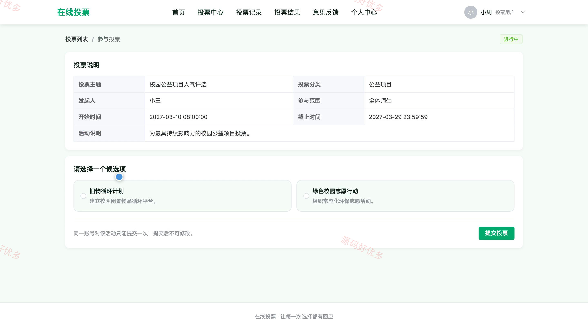
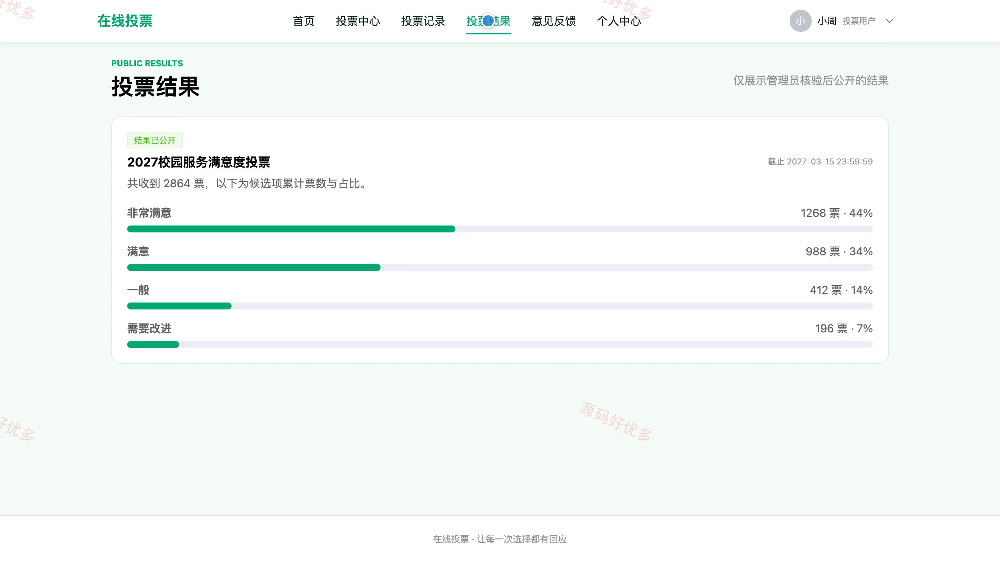
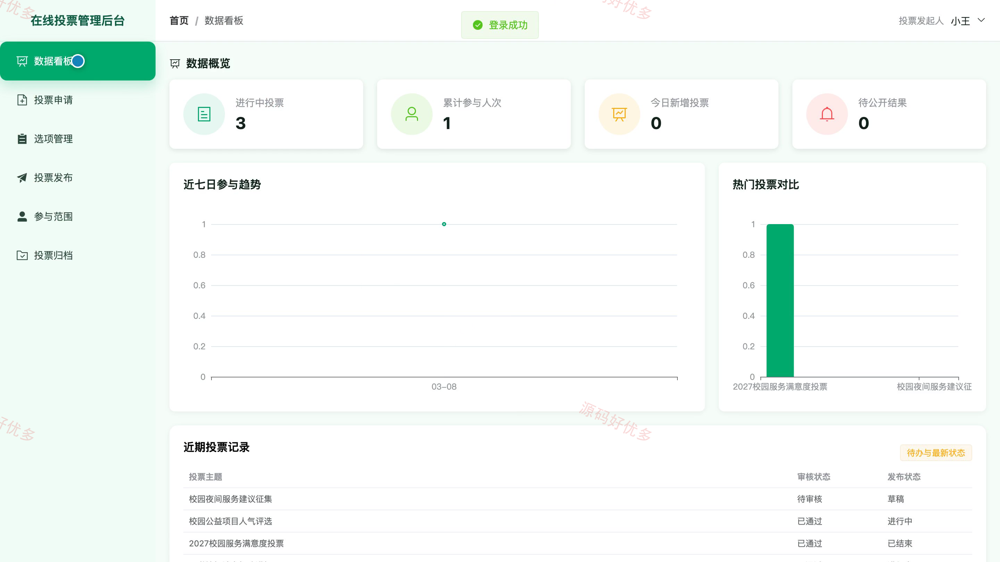
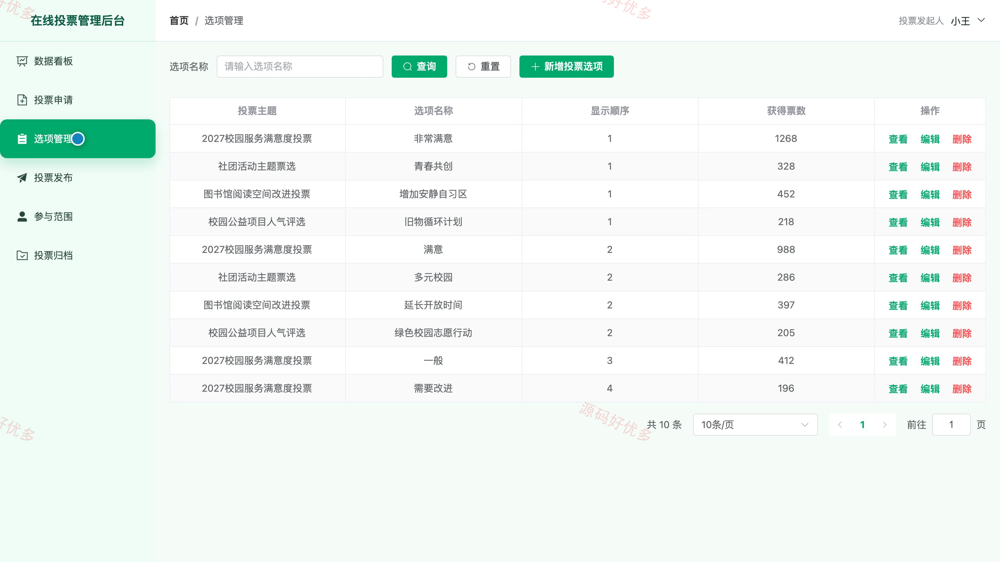
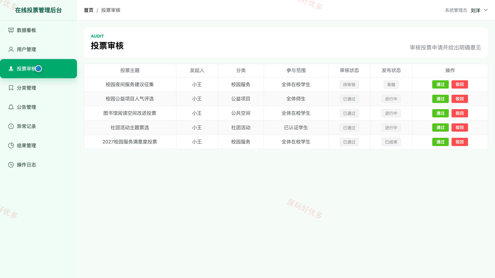
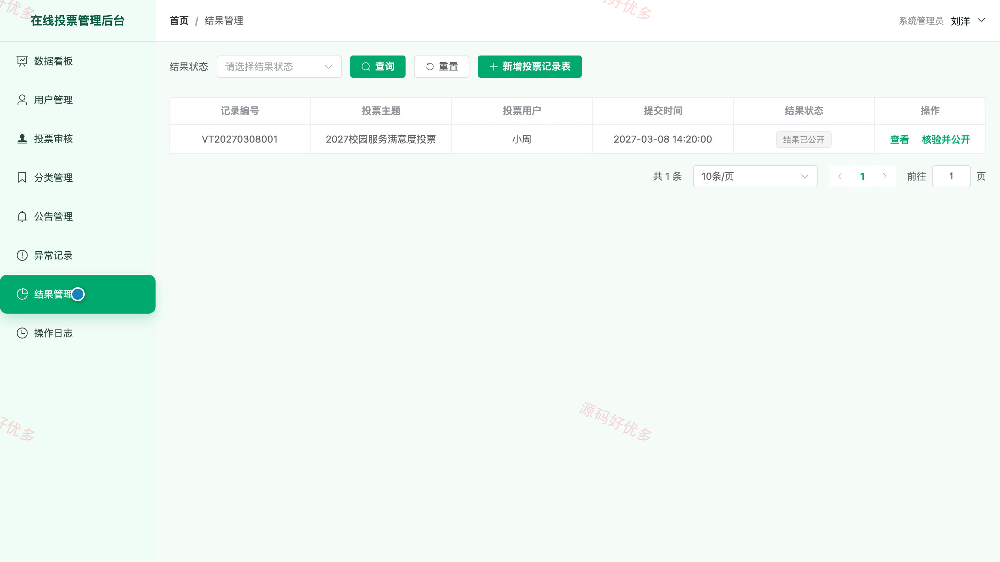

# bs089A
bs089A在线投票系统
## 源码问题查看主页咨询

### 一、关键词
在线投票系统、投票活动管理、投票申请审核、投票结果统计、投票用户管理

### 二、作品包含
源码+数据库+万字设计文档+PPT+全套环境和工具资源+本地部署教程

### 三、项目技术
前端技术： Html、Css、Js、Vue3.4、Element-Plus
后端技术：Java、SpringBoot3.2.0、MyBatis-Plus

### 四、运行环境（以下版本亲测，其他版本兼容性请自行测试）
开发工具：IDEA/eclipse + VSCODE

数据库：MySQL5.7+（共12张表）

数据库管理工具：Navicat10以上版本

环境配置软件： JDK17 + Maven3.6.3

前端Nodejs：20.20.2

浏览器：谷歌浏览器

### 五、项目介绍
项目编号：bs089A

在线投票系统面向投票用户、投票发起人和系统管理员提供完整业务闭环。投票用户可浏览活动、参与投票并查看记录与公开结果；投票发起人负责申请活动、维护选项、发布与归档；系统管理员负责账号、审核、分类、公告、异常记录和结果公开管理。

角色：投票用户、投票发起人、系统管理员

投票用户功能：查看首页推荐投票与公告信息、按关键词和活动状态筛选投票主题、查看投票详情并选择候选项提交投票、按状态查看个人投票记录与所选选项、查看已公开投票结果与票数占比、提交意见反馈、维护个人资料并修改密码。

投票发起人功能：查看投票业务数据看板、维护投票申请全生命周期、维护投票候选选项及显示顺序、发布审核通过的投票活动、维护投票活动参与范围、查看活动结果统计、归档已结束投票并保留历史记录、维护个人资料。

系统管理员功能：查看平台数据看板、维护各类平台账号、审核投票申请并填写审核意见、维护投票分类及启用状态、管理平台公告全生命周期、查看异常投票记录、核验投票记录并公开结果、查看操作日志并维护个人资料。

### 六、运行截图

